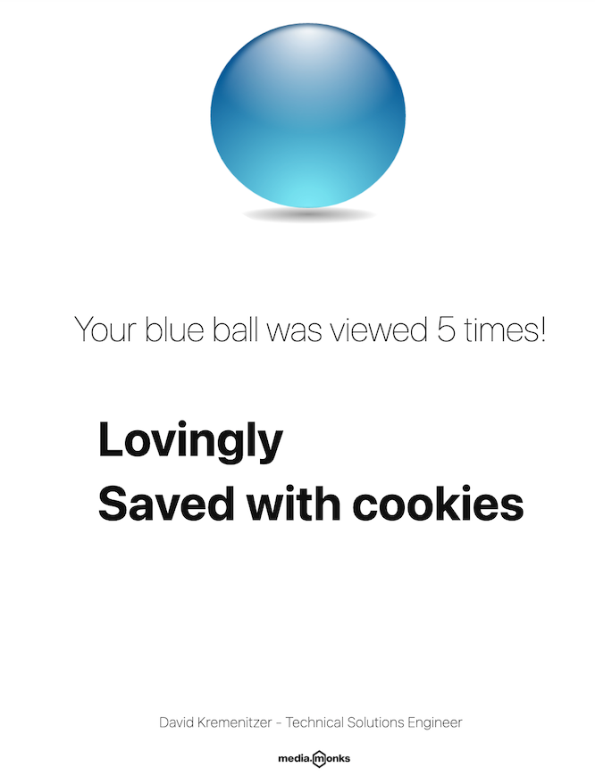

# Media.Monks Challenge - David Kremenitzer


## Introduction
This website shows a user an image of either a red or blue ball upon visiting the page with a 50/50 chance for either. When a user revisits the website the page will display the same color ball they saw previously, as well as the total number of times they visited the site. This was achieved using cookies. The cookies for this project have been set up to expire 24 hours after visiting the site.

## Design
 I created a design layout that was complimentary to Media.Monks distinct, hip and cool UI/UX website by utilizing responsive design, CSS animations, and Media.Monks iconic large bold text
 
 
 
## Technologies used 🛠️
- [JavaScript](https://developer.mozilla.org/en-US/docs/Web/JavaScript) - [CSS](https://developer.mozilla.org/en-US/docs/Web/CSS) - [HTML](https://developer.mozilla.org/en-US/docs/Web/HTML) - [Express](https://expressjs.com/) - [Node](https://nodejs.org/en/) - [Mocha](https://mochajs.org/)

## Mocha Tests
In addition to the challenge requirements, I also have provided unit testing using the Mocha test framework. 

## Run App Locally
```
Instructions: To clone via SSH, enter command git clone git@github.com:Davidkrem/Krem.Monks.git Proceed to enter command: npm install. Please feel free to use VSCode live server or my built in Port running on 3000.
```

## About Me
Voice-Over Artist turned Software Engineer - You’ll soon know my code, but you’ve definitely heard my voice. 

For the last decade I have been a professional commercial/voice-over actor with A3 Artists Agency. I was the voice of the 'bacon dog' in Purina's national commercials, the voice of Subway, and most recently dubbed Tom Holland's voice in post production ADR for his films.

I live in NYC

- [Portfolio Link](https://www.davidkrem.tech)
- [GitHub Profile](https://github.com/Davidkrem)

### Live Demo

- [Demo](https://davidkrem.github.io/Krem.Monks/)
